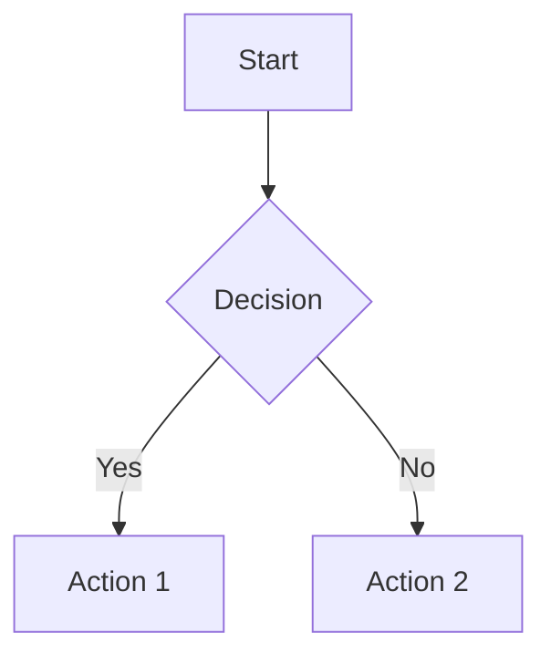

## Why
Reporting every detail with precision is at the heart of my workflow. As an engineer who values clarity, structure, and accountability, I document every step from design to implementation details in my projects. When you rely on Markdown for critical project documentation, any inconsistency or feature gap can derail clarity and most editors simply don’t live up to my standards. It’s precisely this commitment to thorough documentation that drives me to develop this project with precision and purpose. This is why I set out to build this tool from the ground up.

It's just a basic editor afterall. You can use it locally in every type of PC, OS and browser. No logs, no cloud, just an editor.

# 📝 Markdown Editor
A feature-rich, professional-grade markdown editor with live preview, file management, and editing tools. Built with JavaScript, this single-file application provides a comprehensive markdown editing experience similar to modern IDEs on a browser.


## ✨ Features

### Text Editing
- **Word-like Formatting Toolbar**: Quick access to common markdown formatting
- **Live Preview**: Real-time markdown rendering with synchronized scrolling
- **Keyboard Shortcuts**: Standard shortcuts for formatting (Ctrl+B, Ctrl+I, etc.)
- **Color Picker**: Add colored text to your markdown
- **Symbol Inserter**: Easy access to special characters and symbols
- **Smart Text Formatting**: Automatic formatting for headings, lists, links, and more

### File Management
- **Multi-file Support**: Work with multiple markdown files simultaneously
- **Folder Organization**: Create and manage folders for better file organization
- **Drag & Drop Upload**: Simply drag files into the editor
- **Export/Import**: Backup all your work as JSON and restore it later
- **Local Storage**: Automatic saving to browser's local storage
- **File Tree Navigation**: Visual file explorer with context menus

### Advanced Features
- **Mermaid Diagrams**: Create flowcharts, sequence diagrams, and more
- **Diagram Editor**: Visual editor for creating diagrams from JSON or manual input
- **Solution Explorer**: Navigate document structure (headers, links, images, tables)
- **Split View**: Work with multiple files side-by-side (horizontal/vertical)
- **Print & PDF Export**: Print or save your documents as PDF
- **ZIP Download**: Download all files as a compressed archive

### User Experience
- **Dark/Light Themes**: Toggle between themes with Ctrl+Shift+T
- **Tabbed Interface**: Easy switching between open files
- **Resizable Panes**: Adjust editor and preview pane sizes
- **Context Menus**: Right-click actions for files and folders
- **Responsive Design**: Works on desktop and tablet devices
- **Auto-save**: Your work is automatically saved as you type

## Getting Started

### Prerequisites
- Modern web browser (Chrome, Firefox, Safari, Edge)
- No installation required - it's a single HTML file!

### Quick Start
1. Download the `md_editor5.html` file
2. Open it in your web browser
3. Start creating markdown files immediately

### First Steps
1. **Create a New File**: Click "📄 New" in the menu bar
2. **Start Writing**: Use the formatting toolbar or type markdown directly
3. **See Live Preview**: Watch your markdown render in real-time
4. **Organize**: Create folders and organize your documents
5. **Backup**: Use "📦 Backup" to export all your work

## Usage Guide

### Formatting Toolbar
The toolbar provides quick access to common markdown elements:

| Button | Function | Keyboard Shortcut |
|--------|----------|-------------------|
| **B** | Bold text | Ctrl+B |
| *I* | Italic text | Ctrl+I |
| ~~S~~ | Strikethrough | - |
| `</>` | Inline code | - |
| 🎨 | Color picker | - |
| • | Bullet list | - |
| 1. | Numbered list | - |
| 🔗 | Insert link | - |
| 🖼️ | Insert image | - |
| 📊 | Insert table | - |
| > | Blockquote | - |
| {} | Code block | - |
| --- | Horizontal rule | - |

### Keyboard Shortcuts
- `Ctrl+B`: Bold
- `Ctrl+I`: Italic
- `Ctrl+Shift+T`: Toggle theme
- `F11`: Toggle preview

### File Operations
- **New File**: Create a new markdown document
- **New Folder**: Organize files in folders
- **Upload**: Drag & drop or click to upload existing files
- **Export**: Download individual files or all files as ZIP
- **Backup**: Export all data as JSON for backup/migration
- **Import**: Restore from JSON backup

### Mermaid Diagrams
Create diagrams using mermaid syntax:



Use the **📊 Diagram** editor for visual diagram creation.

### Solution Explorer
The Solution Explorer shows the structure of your current document:
- **📚 Headers**: Navigate to different sections
- **🔗 Links**: Jump to links in your document
- **🖼️ Images**: View all images
- **📊 Tables**: Navigate to tables
- **💬 Quotes**: Find blockquotes
- **📋 Code Blocks**: Locate code sections

## 🔧 Technical Details

### Built With
- **Vanilla JavaScript**: No frameworks, pure JavaScript
- **HTML5 & CSS3**: Modern web standards
- **External Libraries**:
  - [Marked.js](https://marked.js.org/) - Markdown parser
  - [Mermaid.js](https://mermaid-js.github.io/) - Diagram generation
  - [jsPDF](https://github.com/parallax/jsPDF) - PDF generation
  - [JSZip](https://stuk.github.io/jszip/) - ZIP file creation

### Browser Compatibility
- ✅ Chrome 80+
- ✅ Firefox 75+
- ✅ Safari 13+
- ✅ Edge 80+
- Probably in all other browsers and versions

### Storage
- Uses browser's `localStorage` for data persistence
- No server required - everything runs locally
- Export/import functionality for data portability

## Features Breakdown

### File Management System
- **Multi-file editing** with tabbed interface
- **Folder hierarchy** support
- **Drag & drop** file upload
- **Context menus** for file operations
- **Auto-save** functionality

### Editor Enhancements
- **Formatting toolbar** with visual buttons
- **Color picker** for text styling
- **Symbol picker** for special characters
- **Smart indentation** and formatting
- **Real-time preview** synchronization

### Export Options
- **Individual file export** (Markdown, HTML, PDF)
- **Bulk export** as ZIP archive
- **Complete backup** as JSON
- **Print-friendly** formatting

### Theme Support
- **Dark theme** (default)
- **Light theme** option
- **Automatic theme persistence**
- **Smooth transitions** between themes

## Data Management

### Backup & Restore
The editor provides comprehensive backup functionality:

1. **📦 Backup**: Exports all files, folders, and settings as a JSON file
2. **📥 Import**: Restores from a previously exported JSON backup
3. **Automatic saving**: All changes are saved to localStorage immediately

### Data Structure
```json
{
  "files": {},      // All markdown files
  "folders": {},    // Folder structure
  "openFiles": [],  // Currently open tabs
  "fileCounter": 0, // File ID counter
  "folderCounter": 0 // Folder ID counter
}
```

## Customization

### Themes
The editor supports both dark and light themes with CSS custom properties. Themes can be switched using:
- Menu button (🌙 Dark / ☀️ Light)
- Keyboard shortcut (Ctrl+Shift+T)

### Color Scheme
Themes use CSS variables for easy customization:
```css
:root {
  --bg-primary: #1e1e1e;
  --text-primary: #cccccc;
  --accent-color: #007acc;
  /* ... more variables */
}
```

## 📊 Advanced Features

### Mermaid Integration
- **Built-in diagram support** for flowcharts, sequence diagrams, and more
- **Visual diagram editor** with JSON-to-Mermaid conversion
- **Real-time preview** of diagrams
- **Error handling** for invalid diagram syntax

### Solution Explorer
- **Document structure analysis** showing headers, links, images, etc.
- **Click-to-navigate** functionality
- **Synchronized highlighting** between editor and preview
- **Collapsible sections** for better organization

### Split View
- **Horizontal/vertical splitting** for multi-file editing
- **Independent preview** for each split
- **Resizable panes** with drag handles
- **Context switching** between splits

### Limitations
- **Browser storage limits** (~5-10MB depending on browser)
- **Large file performance** may vary
- **No real-time collaboration** (single-user application)

## License

This project is open source and available under the MIT License.

---

**Made with love for markdown enthusiasts**

*Last updated: 2025-07-30*
